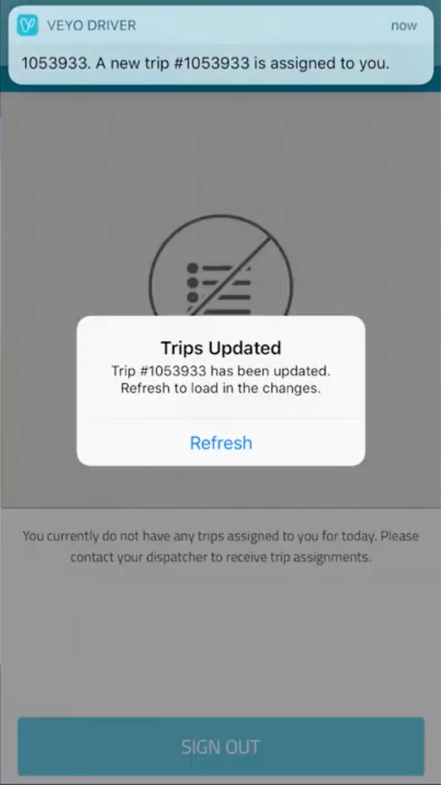
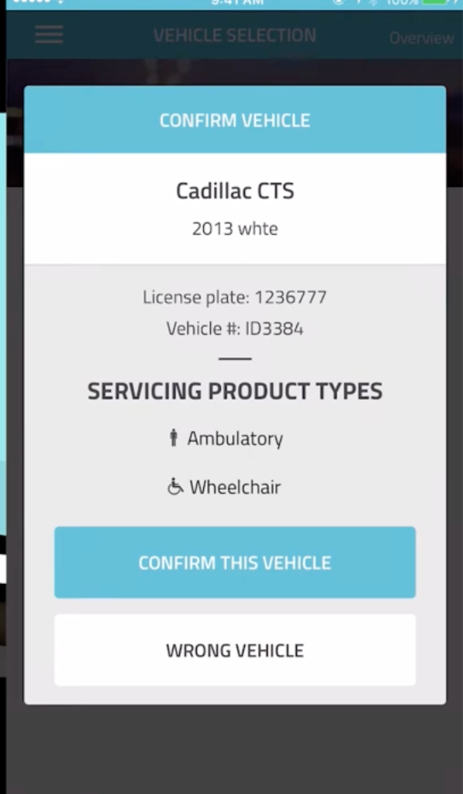
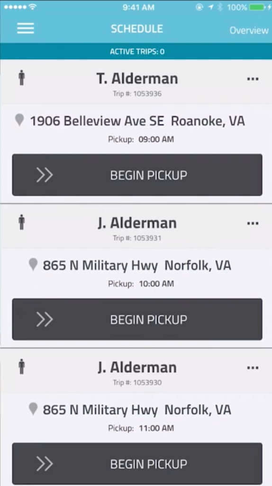
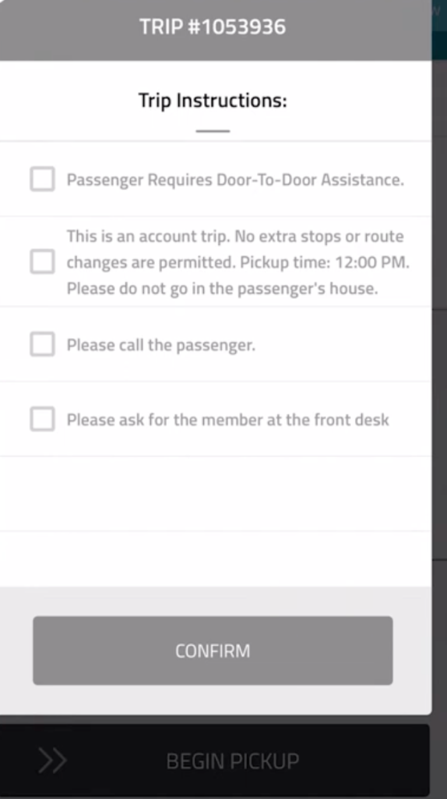
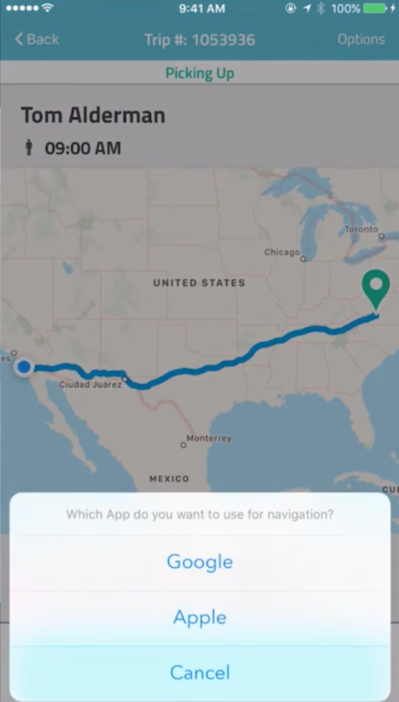

# Veyo Driver App - Complete UI Specification

> **Purpose**: Comprehensive reference document for replicating the Veyo Driver app in DriveMe.
> Includes actual screenshots, complete video transcript, and detailed component specifications.

---

## Video Source

**Source**: [Veyo Driver App Training Video](https://www.youtube.com/watch?v=jbC-SiZXUIQ)

---

## Complete Video Transcript

### Introduction

> Welcome to Veyo's driver app training video. Today we will demonstrate the Veyo driver app. Our app was built to make trip assignment, trip completion, and trip finalization easy for providers and their drivers, dramatically reducing administrative burdens and helping to prevent fraud, waste, and abuse.

> The app streams dispatched from the Veyo provider portal directly to drivers' phones in real-time. Drivers can use their smartphone or tablet to view all of their trips for the day, review special trip instructions, access navigation using their preferred app, and capture and finalize trip data automatically.

> Once the trip is complete, the trip is automatically submitted for billing and payment arrives the following week. Please note that all members and protected health information shown in this demo are fictitious.

---

### Part 1: Dispatching Trips to Drivers (Provider Portal)

> Let's begin with how to dispatch trips to your drivers. To start, you must first accept trips in the provider portal. Begin by logging into the provider portal at **providers.veyo.com** and going to the **Accept Trips** tab.

> Once your trips have been accepted, you can now go to the **Assign Trips to Drivers** tab. There are two ways to assign trips to drivers:
> 1. You can either assign trips directly through the portal
> 2. Or you can upload trip assignments through an Excel spreadsheet

#### Method 1: Direct Portal Assignment

> Let's look at the first option. To assign trips through the portal, start with the date filter. Select the date or range of dates for which you would like to assign trips.

> Now that you have some trips selected, you can assign a driver to them. Look at the **driver column** of the trip grid and click on the box that prompts you to enter driver name. Select a driver by entering his or her name or driver ID number, or by selecting them in the drop-down menu.

> Once you have selected a driver, the trip will **automatically be sent to the driver's phone** running the Veyo driver app.

#### Method 2: Excel Spreadsheet Upload

> The second method of assigning trips is through an Excel spreadsheet. Again, begin by checking the date filter and selecting the date or range of dates for which you would like to assign trips.

> Then click the **green Export button** at the top right to download an Excel file containing the trips that need to be assigned. You can assign trips to drivers in the Excel sheet by clicking on the cells in the driver column and using the drop-down menu to populate each cell with drivers. **Make sure to save your Excel sheet once you're finished.**

> Once all of the drivers have been populated, upload the Excel sheet to the portal by clicking the **yellow Upload button** at the top right corner. The portal will then display a summary of all trips that have been assigned:
> - Trips that are assigned correctly will say **"Pending"**
> - Incorrectly assigned trips will say **"Failed"**

> To fix incorrectly assigned trips, download the error file by clicking **Download Import Results File** and try the assignments again after making changes. Upload the file again.

> When all the assignments are made, review the import summary that shows the number of trips each driver was assigned. If it is incorrect, go back to the Assign Trips to Drivers tab and correct any mistakes. If the assignments are correct, click **Confirm**.

> Once trips have been assigned to drivers, the portal will automatically send the trips to the drivers' phones that are running the Veyo driver app. **You have now completed the trip dispatch process.**

---

### Part 2: Driver App Setup & Login

> Now we will move on to using the driver app. You'll require several documents and pieces of information to create app accounts for each driver:
> - A list of drivers for each provider company with individual emails and phone numbers
> - A list of the company's vehicles
> - Copies of the vehicle registration, insurance, and inspection forms

> You can check for device compatibility at **partner.veyo.com/app**.

> To log into the driver app, the driver will enter their email address or phone number. Their initial temporary password is set by Veyo. To change the password, click **Forgot Password** and enter the email address associated with the driver's account. They will receive an email with instructions to change the password.

> **Be sure to enable push notifications on the drivers' devices so that they will receive real-time trip updates and notifications.**

---

### Part 3: Overview & Vehicle Selection

> Once the driver logs into the app, start by checking the **Overview of assigned trips**. If no trips have been assigned, "No trip overview available" will be displayed. Press the **refresh button** at the top right of the screen frequently to show any newly assigned trips.

> Suppose the driver is ready to start driving for the day and has reviewed the trips for the day. Once they press **Start Taking Trips**, it will prompt them to log in with the vehicle they're driving.

> Enter the first few digits of the license plate or vehicle number and select the correct vehicle from the drop-down. The **Confirm Vehicle** screen will show the vehicle information including the vehicle make/model and ask the driver to confirm that it is correct.

> If the wrong vehicle has been selected, press **Wrong Vehicle** to go back and select a different one.

---

### Part 4: Schedule & Begin Pickup

> After the driver confirms their vehicle, we'll go to the **Schedule page** showing all trips for the day in time order.

> When the driver is ready to drive to the first pickup location, they should **swipe from left to right on Begin Pickup** and confirm.

> A **Trip Instructions pop-up** will prompt the driver to confirm trip or member-specific information. **These instructions are important, so please read them carefully.** After reading the instructions, **check all of the boxes** and hit **Confirm**.

> For additional information on a trip, press the icon that looks like **three dots** at the top-right corner of the screen.

---

### Part 5: Navigation & Pickup

> You can select a GPS navigation app of your choice by hitting the **arrow icon** on the bottom right. The apps that will be shown depend on what the driver has installed on their device. **Veyo uses Google Maps to determine trip distances and fares.**

> Upon arrival at the pickup location for the first member, the driver once again **swipes left to right on Arrived at Pickup**.

> The driver should then:
> 1. Call the member
> 2. Meet them at the door
> 3. Assist them into the vehicle
> 4. Provide any additional assistance specified in the trip instructions

> **If the member does not answer their phone, they must be sure to knock on the door and wait at least 5 minutes after arriving or after the scheduled pickup, whichever is later.**

> If the driver is at the wrong location, a pop-up will notify them that they are more than one mile away.

> After the member is safely in the vehicle, **swipe left to right on Pickup is Done** and proceed to the drop-off location.

> As always, the driver should keep conversation light and neutral. **Avoid topics such as religion, politics, and members' personal lives.**

---

### Part 6: Drop-off & Trip Completion

> After arriving at the drop-off location, the driver should assist the member out of the vehicle and to the door, following any special trip instructions.

> After the member has been safely dropped off, **swipe from left to right on Drop-off is Done**.

> When a trip is complete, it will appear in the **Done Trips section** at the bottom of the Schedule as well as the bottom of the Trip Overview.

---

### Part 7: Additional Features

#### Canceling a Trip

> The Veyo driver app has several additional features, such as the ability to cancel a trip.

> To cancel a trip:
> 1. Press the **three dots icon** to view the trip details
> 2. Press the **Options button** at the top right of the screen
> 3. After pressing **Cancel Trip**, choose from the list of reasons for the cancellation
> 4. Type a detailed description of why the trip was canceled

> **Veyo reviews this information, so please be as accurate as possible.**

#### Multi-Loading (Multiple Passengers)

> If you are multi-loading members in your vehicle, just swipe:
> - Begin Pickup
> - Arrived at Pickup
> - Pickup is Done
> - Drop-off is Done

> ...for each member **in the same order** in which they are being picked up and dropped off.

> **Be sure to swipe at the correct time and location for each member to avoid problems with the trip data or app.**

#### ⚠️ Fraud Prevention Warning

> **Also make sure that drivers do NOT swipe through all of the stages of the trip at once. If they do this, the trip data may look fraudulent and will be flagged for investigation.**

#### Accident/Incident Reports

> You can also access Veyo's **accident and incident report form** directly from the app.

---

### Support Contacts

| Type | Email |
|------|-------|
| Portal/App Questions | providers@veyo.com |
| Trip-Related Issues | providersupport@veyo.com |

> We appreciate your feedback. Thank you for partnering with Veyo and being a part of the next generation of patient transportation.

---

## Screen-by-Screen Breakdown

### Screen 1: Push Notification & Trip Update Alert



**Video Context:** "Be sure to enable push notifications on the drivers' devices so that they will receive real-time trip updates and notifications."

| Component | Details |
|-----------|---------|
| **Push Banner** | Cyan background, "VEYO DRIVER" logo, "now" timestamp |
| **Message** | "1053933. A new trip #1053933 is assigned to you." |
| **Modal Overlay** | Grayed-out background with centered card |
| **Update Card** | White card with icon, "Trips Updated" title |
| **Refresh Button** | Cyan text link: "Refresh" |
| **Empty State** | "You currently do not have any trips assigned to you for today. Please contact your dispatcher to receive trip assignments." |
| **Sign Out Button** | Full-width teal/gray button |

---

### Screen 2: Vehicle Selection / Confirmation



**Video Context:** "The Confirm Vehicle screen will show the vehicle information including the vehicle make/model and ask the driver to confirm that it is correct. If the wrong vehicle has been selected, press Wrong Vehicle to go back."

| Component | Details |
|-----------|---------|
| **Header** | Teal bar: "☰ VEHICLE SELECTION" + "Overview" link |
| **Card Header** | Cyan bar: "CONFIRM VEHICLE" |
| **Vehicle Info** | "Cadillac CTS" / "2013 white" |
| **Details** | "License plate: 1236777" / "Vehicle #: ID3384" |
| **Service Types** | "🚶 Ambulatory" / "♿ Wheelchair" |
| **Primary CTA** | Cyan: "CONFIRM THIS VEHICLE" |
| **Secondary CTA** | White: "WRONG VEHICLE" |

---

### Screen 3: Schedule / Trip List View



**Video Context:** "After the driver confirms their vehicle, we'll go to the Schedule page showing all trips for the day in time order."

| Component | Details |
|-----------|---------|
| **Header** | Teal: "☰ SCHEDULE" + "Overview" |
| **Status Bar** | Cyan: "ACTIVE TRIPS: 0" |
| **Trip Cards** | Scrollable list |

**Trip Card Structure:**
- 🚶 Passenger icon
- Name (e.g., "T. Alderman")
- Trip # (e.g., "Trip #: 1053936")
- "..." menu (top-right)
- 📍 Address with pickup time
- **">> BEGIN PICKUP"** swipe button

---

### Screen 4: Trip Instructions (Mandatory Checklist)



**Video Context:** "A Trip Instructions pop-up will prompt the driver to confirm trip or member-specific information. These instructions are important, so please read them carefully. After reading the instructions, check all of the boxes and hit Confirm."

| Component | Details |
|-----------|---------|
| **Header** | Dark teal: "TRIP #1053936" |
| **Title** | "Trip Instructions:" |
| **Checkboxes** | Unchecked square boxes |
| **Confirm Button** | Gray (disabled until all checked) |
| **Footer** | ">> BEGIN PICKUP" (locked) |

**Example Instructions:**
1. ☐ Passenger Requires Door-To-Door Assistance.
2. ☐ This is an account trip. No extra stops or route changes are permitted. Pickup time: 12:00 PM. Please do not go in the passenger's house.
3. ☐ Please call the passenger.
4. ☐ Please ask for the member at the front desk

---

### Screen 5: Active Trip - Map View



**Video Context:** "You can select a GPS navigation app of your choice by hitting the arrow icon. Veyo uses Google Maps to determine trip distances and fares."

| Component | Details |
|-----------|---------|
| **Header** | "< Back" / "Trip #: 1053936" / "Options" |
| **Status** | Cyan: "Picking Up" |
| **Member Info** | "Tom Alderman" / "🚶 09:00 AM" |
| **Map** | Full-screen with route line |
| **Navigation Modal** | iOS action sheet |

**Navigation Options:**
- "Google" (Opens Google Maps)
- "Apple" (Opens Apple Maps)
- "Cancel"

---

## Complete Driver Workflow

```
LOGIN
  └─→ Enter email/phone + password
       └─→ Enable push notifications ⚠️

VEHICLE SELECTION
  └─→ Enter license plate / vehicle #
       └─→ Confirm vehicle details
            └─→ Verify service types

VIEW SCHEDULE
  └─→ Pull-to-refresh for new trips
       └─→ Review all assigned trips

SELECT TRIP
  └─→ Swipe ">> BEGIN PICKUP"
       └─→ READ Trip Instructions
            └─→ Check ALL boxes
                 └─→ Tap "CONFIRM"

NAVIGATE TO PICKUP
  └─→ Select navigation app (Google/Apple)
       └─→ Drive to pickup

AT PICKUP
  └─→ Swipe "ARRIVED AT PICKUP"
       └─→ Call passenger
            └─→ Wait 5 min if no-show
                 └─→ Assist to vehicle

PICKUP COMPLETE
  └─→ Swipe "PICKUP IS DONE"
       └─→ Navigate to destination

AT DESTINATION
  └─→ Swipe "ARRIVED AT DROP-OFF"
       └─→ Assist to door

TRIP COMPLETE
  └─→ Swipe "DROP-OFF IS DONE"
       └─→ Trip auto-submitted for billing
            └─→ Return to Schedule
```

---

## Design System

### Colors
| Name | Hex | Usage |
|------|-----|-------|
| Primary Teal | `#00BCD4` | Headers, CTAs, status |
| Dark Teal | `#0097A7` | Header backgrounds |
| Success Green | `#4CAF50` | Pins, confirmations |
| Dark Gray | `#424242` | Swipe buttons |
| White | `#FFFFFF` | Cards, backgrounds |

### Typography
| Element | Style |
|---------|-------|
| Headers | 16px Bold, White, CAPS |
| Card Titles | 18px Bold, Black |
| Body | 14px Regular, Gray |
| Buttons | 14px Medium, White |

---

## Implementation Checklist

### Priority 1: Core Screens
- [ ] Login Screen
- [ ] Push Notifications
- [ ] Vehicle Selection
- [ ] Schedule/Trip List
- [ ] Trip Instructions Checklist
- [ ] Map View
- [ ] Navigation Selector

### Priority 2: Interactions
- [ ] Swipe-to-action
- [ ] Pull-to-refresh
- [ ] Checkbox flow
- [ ] Status transitions

### Priority 3: Backend
- [ ] Push notification service
- [ ] Real-time sync
- [ ] Google Maps API
- [ ] Trip status updates

---

*Generated from Veyo Driver App Training Video with user-provided screenshots and transcript*
